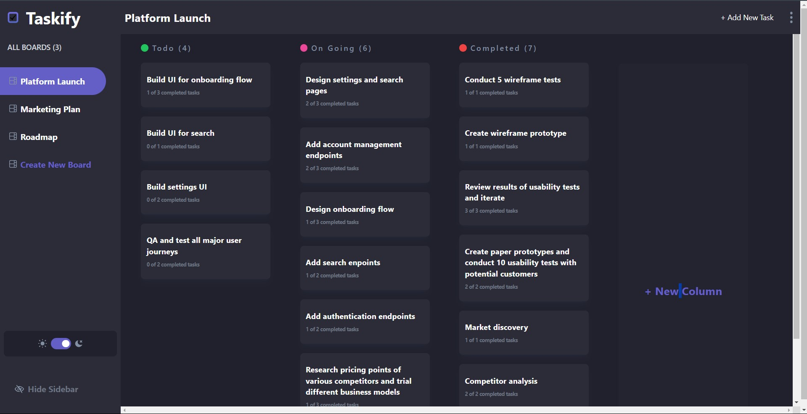

# Taskify task management

## Table of contents

-  [Overview](#overview)
-  [The challenge](#the-challenge)
-  [Screenshot](#screenshot)
-  [Links](#links)
-  [Built with](#built-with)
-  [Prerequisites](#prerequisites)

## Overview

### The challenge

Users should be able to:

-  View the optimal layout for the app depending on their device's screen size
-  See hover states for all interactive elements on the page
-  Create, read, update, and delete boards and tasks
-  Receive form validations when trying to create/edit boards and tasks
-  Mark subtasks as complete and move tasks between columns
-  Hide/show the board sidebar

Expected Behaviour:

-  Boards
   -  Clicking different boards in the sidebar will change to the selected board.
   -  Clicking "Create New Board" in the sidebar opens the "Add New Board" modal.
   -  Clicking in the dropdown menu "Edit Board" opens up the "Edit Board" modal where details can be changed.
   -  Columns are added and removed for the Add/Edit Board modals.
   -  Deleting a board deletes all columns and tasks and requires confirmation.
-  Columns
   -  A board needs at least one column before tasks can be added. If no columns exist, the "Add New Task" button in the header is disabled.
   -  Clicking "Add New Column" opens the "Edit Board" modal where columns are added.
-  Tasks
   -  Adding a new task adds it to the bottom of the relevant column.
   -  Updating a task's status will move the task to the relevant column.

Bonus:

-  The tasks can be dragged and dropped to a new column.

### Screenshot



### Links

-  Live Site URL: [Taskify Task Management](https://taskify-task-management.netlify.app/)

### Built with

-  [Vite](https://vitejs.dev/) - Frontend Build Tool for React
-  [React](https://react.dev/) - JavaScript Library for Building User Interfaces
-  [TailwindCSS](https://tailwindcss.com/) - CSS Framework
-  Drag and Drop API
-  [Redux](https://redux.js.org/) - State Management Tool

## Prerequisites:

-  Make sure you have Git installed on your machine. If not, you can download it from [Git](https://git-scm.com/downloads).
-  Node.js should be installed. You can download it from [Node.js](https://nodejs.org/).

**Steps:**

1. **Clone the GitHub Repository:** Open your terminal or command prompt and navigate to the directory where you want to clone the project. Then run the following command:
   ```bash
   git clone https://github.com/mspsohan/taskify-task-management.git
   ```
2. Navigate to the Project Directory:

   ```bash
   cd taskify-task-management
   ```

3. **Install Dependencies:** Run the following command to install the project dependencies using npm:
   ```bash
   npm install
   ```
4. **Run the Project:** After the installation is complete, you can start the development server. Use the following command:
   ```
   npm run dev
   ```
   This command will build your project and start a local development server. Open your browser and navigate to the provided URL (usually http://localhost:5173).
